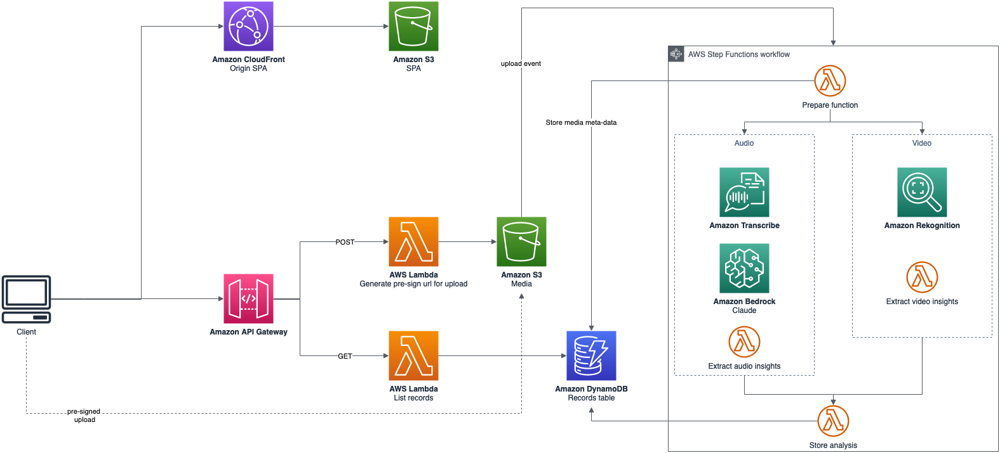

# AI/ML Interview Simulator

A production-ready serverless application for interview simulation and mentorship.



## Prerequisites

- AWS CLI configured
- AWS SAM CLI installed
- Node.js v18.16.0, NPM v9.5.1
- Python v3.8.8
- Region: us-east-1
- Access to Claude Sonnet 3.7 model in Amazon Bedrock

## Quick Start

### 1. Deploy Backend

```bash
cd backend
sam build
sam deploy --stack-name interview-backend --resolve-s3 --resolve-image-repos --capabilities CAPABILITY_AUTO_EXPAND CAPABILITY_IAM
```

Get the API endpoint:
```bash
aws cloudformation describe-stacks --stack-name interview-backend \
  --query 'Stacks[0].Outputs[?OutputKey==`ApiGatewayEndpoint`].OutputValue' \
  --output text
```

### 2. Update API Configuration

Update the API endpoint in `frontend/src/services/api.js`

### 3. Deploy Frontend

```bash
cd frontend
npm install
npm run build

# Deploy to AWS
aws cloudformation create-stack --stack-name interview-frontend --template-body file://template.yaml
aws cloudformation wait stack-create-complete --stack-name interview-frontend
bucket_name=$(aws cloudformation describe-stacks --stack-name interview-frontend --query 'Stacks[0].Outputs[?OutputKey==`BucketName`].OutputValue' --output text)
cloudfront_id=$(aws cloudformation describe-stacks --stack-name interview-frontend --query 'Stacks[0].Outputs[?OutputKey==`CFDistributionID`].OutputValue' --output text)
cloudfront_name=$(aws cloudformation describe-stacks --stack-name interview-frontend --query 'Stacks[0].Outputs[?OutputKey==`CFDistributionName`].OutputValue' --output text)
aws s3 sync ./build s3://$bucket_name
aws cloudfront create-invalidation --distribution-id $cloudfront_id --paths "/*"
echo $cloudfront_name
```

## Architecture Components

- **Frontend**: React application
- **API Gateway**: REST API endpoints
- **Lambda Functions**: Serverless compute
- **Step Functions**: Orchestrates video analysis workflow
- **S3**: Media file storage
- **DynamoDB**: Interview records storage
- **Amazon Transcribe**: Speech-to-text conversion
- **Amazon Bedrock**: AI-powered text analysis

## Cleanup

```bash
# Delete frontend
aws s3 rm s3://$bucket_name --recursive
aws cloudformation delete-stack --stack-name interview-frontend
aws cloudformation wait stack-delete-complete --stack-name interview-frontend

# Delete backend
aws cloudformation delete-stack --stack-name interview-backend
aws cloudformation wait stack-delete-complete --stack-name interview-backend
```

## Disclaimer

Sample code, software libraries, command line tools, proofs of concept, templates, or other related technology are provided as AWS Content or Third-Party Content under the AWS Customer Agreement, or the relevant written agreement between you and AWS (whichever applies). You should not use this AWS Content or Third-Party Content in your production accounts, or on production or other critical data. You are responsible for testing, securing, and optimizing the AWS Content or Third-Party Content, such as sample code, as appropriate for production grade use based on your specific quality control practices and standards. Deploying AWS Content or Third-Party Content may incur AWS charges for creating or using AWS chargeable resources, such as running Amazon EC2 instances or using Amazon S3 storage.