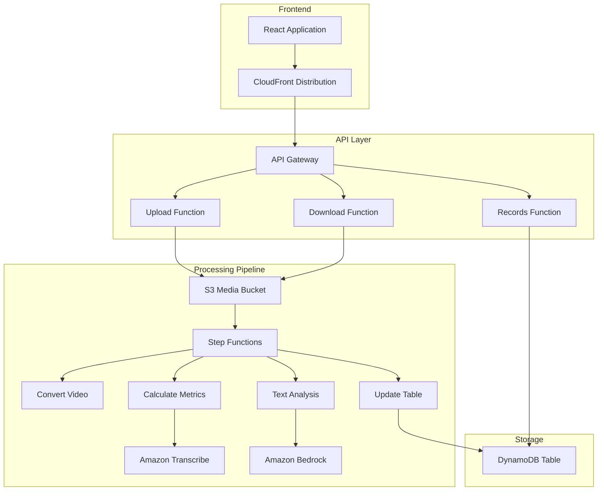
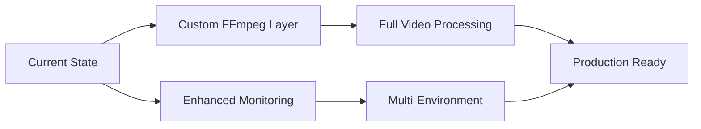

# Interview Simulator - Infrastructure as Code

## 📋 Overview

This document describes the updated infrastructure as code for the Interview Simulator project, including all fixes, improvements, and deployment strategies implemented to resolve the original FFmpeg layer and runtime issues.

## 🏗️ Architecture



## 📁 Infrastructure Files

### Core Templates

| File | Purpose | Status |
|------|---------|--------|
| `template.yaml` | Current working template | ✅ Active |
| `template-updated.yaml` | Comprehensive updated template | 🆕 New |
| `template-with-custom-ffmpeg.yaml` | Template with FFmpeg layer | 🔄 Future |
| `template.yaml.backup` | Original template backup | 📦 Archive |

### Deployment Scripts

| File | Purpose |
|------|---------|
| `migrate-infrastructure.sh` | Automated migration script |
| `build-ffmpeg-layer.sh` | FFmpeg layer build script |

### Documentation

| File | Purpose |
|------|---------|
| `DEPLOYMENT_GUIDE.md` | Comprehensive deployment guide |
| `FFMPEG_LAYER_GUIDE.md` | FFmpeg implementation guide |
| `README-INFRASTRUCTURE.md` | This file |

## 🔧 Infrastructure Components

### Lambda Functions

#### API Functions
- **Runtime**: Python 3.9
- **Memory**: 128MB
- **Timeout**: 10s
- **Purpose**: Handle HTTP requests

```yaml
AddRecordFunction:
  Type: AWS::Serverless::Function
  Properties:
    Runtime: python3.9
    Handler: app.lambda_handler
    Events:
      ApiRequest:
        Type: Api
        Properties:
          Path: /record
          Method: post
```

#### Processing Functions
- **Runtime**: Python 3.9
- **Memory**: 2240MB (video) / 256MB (table)
- **Timeout**: 120-300s
- **Purpose**: Video and text processing

```yaml
ConvertVideoFunction:
  Type: AWS::Serverless::Function
  Properties:
    Runtime: python3.9
    Timeout: 120
    MemorySize: 2240
    Environment:
      Variables:
        FFMPEG_ENABLED: !Ref EnableFFmpegLayer
```

### Step Functions State Machine

```yaml
StateMachine:
  Type: AWS::Serverless::StateMachine
  Properties:
    DefinitionUri: src/statesmachine/analyze.yaml
    Policies:
      - LambdaInvokePolicy
      - S3CrudPolicy
      - TranscribeJobPolicy
```

### Storage Resources

#### S3 Bucket
```yaml
MediaBucket:
  Type: AWS::S3::Bucket
  Properties:
    AccelerateConfiguration:
      AccelerationStatus: Enabled
    CorsConfiguration:
      CorsRules: [...]
```

#### DynamoDB Table
```yaml
RecordsTable:
  Type: AWS::DynamoDB::Table
  Properties:
    BillingMode: PAY_PER_REQUEST  # Cost-optimized
    GlobalSecondaryIndexes: [...]
```

## 🚀 Deployment Strategies

### Strategy 1: Quick Deploy (Recommended)

For immediate deployment with current fixes:

```bash
# Clone and navigate
git clone <repository>
cd backend

# Deploy with current template
sam build
sam deploy --guided
```

### Strategy 2: Automated Migration

Use the migration script for existing deployments:

```bash
# Run automated migration
./migrate-infrastructure.sh
```

### Strategy 3: Manual Migration

Step-by-step manual process:

```bash
# 1. Backup current state
aws cloudformation describe-stacks --stack-name interview-backend > backup.json

# 2. Update template
cp template-updated.yaml template.yaml

# 3. Deploy changes
sam build && sam deploy
```

## 🔄 Configuration Management

### Environment Variables

| Component | Variable | Value | Purpose |
|-----------|----------|-------|---------|
| All Functions | `BUCKET` | S3 bucket name | File operations |
| Video Functions | `FFMPEG_ENABLED` | true/false | Feature flag |
| Table Function | `TABLE_NAME` | DynamoDB table | Database access |

### Parameters

| Parameter | Default | Options | Description |
|-----------|---------|---------|-------------|
| `EnableFFmpegLayer` | false | true/false | Enable FFmpeg processing |
| `RecordsTableSecondaryIndex` | user_index | string | GSI name |

### Conditional Resources

```yaml
Conditions:
  UseFFmpegLayer: !Equals [!Ref EnableFFmpegLayer, "true"]

Resources:
  CustomFFmpegLayer:
    Type: AWS::Lambda::LayerVersion
    Condition: UseFFmpegLayer
```

## 🔍 Monitoring and Observability

### CloudWatch Integration

```yaml
Globals:
  Function:
    Tracing: Active  # X-Ray tracing enabled

StateMachine:
  Properties:
    Tracing:
      Enabled: true  # Step Functions tracing
```

### Log Groups

- `/aws/lambda/interview-backend-*` - Lambda function logs
- `/aws/stepfunctions/StateMachine/*` - Step Functions logs
- `/aws/apigateway/*` - API Gateway logs

### Metrics and Alarms

Key metrics to monitor:
- Lambda function duration and errors
- Step Functions execution status
- API Gateway 4xx/5xx errors
- DynamoDB throttling

## 🛡️ Security Configuration

### IAM Policies

```yaml
Policies:
  - DynamoDBCrudPolicy:
      TableName: !Ref RecordsTable
  - S3CrudPolicy:
      BucketName: !Ref MediaBucket
  - LambdaInvokePolicy:
      FunctionName: !Ref ProcessingFunction
```

### Resource-Level Permissions

- Least privilege access
- Function-specific policies
- Cross-service permissions

### Data Protection

- S3 bucket encryption
- DynamoDB encryption at rest
- API Gateway CORS configuration

## 📊 Cost Optimization

### Billing Mode Changes

```yaml
# Before: Provisioned throughput
ProvisionedThroughput:
  ReadCapacityUnits: 5
  WriteCapacityUnits: 5

# After: Pay-per-request
BillingMode: PAY_PER_REQUEST
```

### Function Optimization

- Right-sized memory allocation
- Appropriate timeout settings
- Efficient runtime selection

## 🔧 Troubleshooting

### Common Issues

1. **Template Validation Errors**
   ```bash
   sam validate --template template.yaml
   ```

2. **Deployment Failures**
   ```bash
   aws cloudformation describe-stack-events --stack-name interview-backend
   ```

3. **Function Errors**
   ```bash
   sam logs --stack-name interview-backend --tail
   ```

### Debug Commands

```bash
# Check stack status
aws cloudformation describe-stacks --stack-name interview-backend

# View recent executions
aws stepfunctions list-executions --state-machine-arn <arn>

# Test API endpoint
curl -X GET https://<api-id>.execute-api.us-east-1.amazonaws.com/Prod/records
```

## 🔄 Version History

### v2.0 (Current)
- ✅ Python 3.9 runtime
- ✅ FFmpeg layer conditional support
- ✅ Enhanced error handling
- ✅ DynamoDB pay-per-request
- ✅ Comprehensive documentation

### v1.1 (Fixes)
- ✅ UpdateTableFunction Decimal conversion
- ✅ Data structure compatibility
- ✅ Timeout optimizations

### v1.0 (Original)
- Python 3.8 runtime
- FFmpeg layer dependencies
- Basic error handling

## 🚀 Future Enhancements

### Planned Improvements

1. **Custom FFmpeg Layer**
   - Build and deploy custom layer
   - Enable full video processing
   - Remove temporary implementations

2. **Enhanced Monitoring**
   - Custom CloudWatch dashboards
   - Automated alerting
   - Performance metrics

3. **Multi-Environment Support**
   - Development/staging/production
   - Environment-specific configurations
   - Automated testing

### Migration Path



## 📚 Additional Resources

- [AWS SAM Documentation](https://docs.aws.amazon.com/serverless-application-model/)
- [Step Functions Best Practices](https://docs.aws.amazon.com/step-functions/latest/dg/bp-lambda-serviceexception.html)
- [Lambda Best Practices](https://docs.aws.amazon.com/lambda/latest/dg/best-practices.html)
- [DynamoDB Best Practices](https://docs.aws.amazon.com/amazondynamodb/latest/developerguide/best-practices.html)

## 🤝 Contributing

### Infrastructure Changes

1. Update appropriate template file
2. Test in development environment
3. Update documentation
4. Create migration guide if needed

### Code Changes

1. Update Lambda function code
2. Test locally with SAM
3. Deploy to development
4. Update infrastructure if needed

## 📞 Support

For infrastructure-related issues:

1. Check CloudFormation events
2. Review CloudWatch logs
3. Validate IAM permissions
4. Test with minimal configuration

---

**Last Updated**: $(date)
**Version**: 2.0
**Status**: Production Ready
